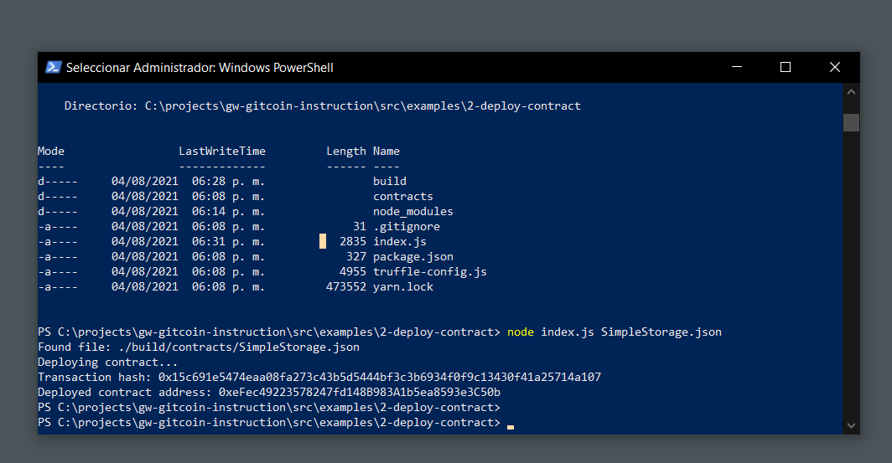

# Deploy A Simple Ethereum Smart Contract On Polyjuice

## Task Submission

### ¡Smart Contract Deployed!

## Transaction hash and smart contract address 

[Transaction hash](./assets/transaction-hash.txt)

[Smart contract address](./assets/contract-address.txt)
