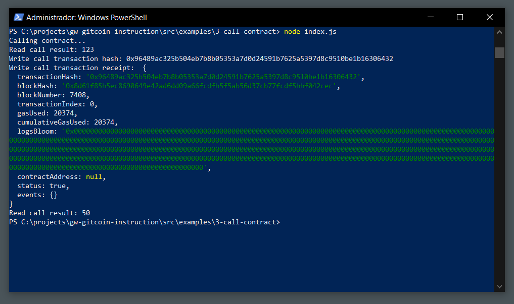

# Issue A Smart Contract Call To The Deployed Smart Contract

## Task Submission

### Console output of the smart contract call.

[The transaction hash](./assets/transaction-hash.txt)

[The contract address ](./assets/contract-address.txt)

[The ABI for contract ](./assets/abi-contract.txt)
