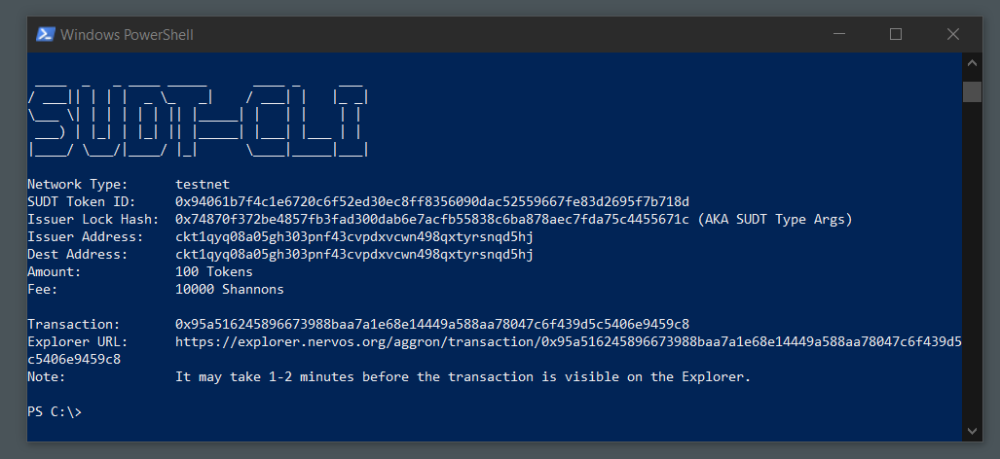
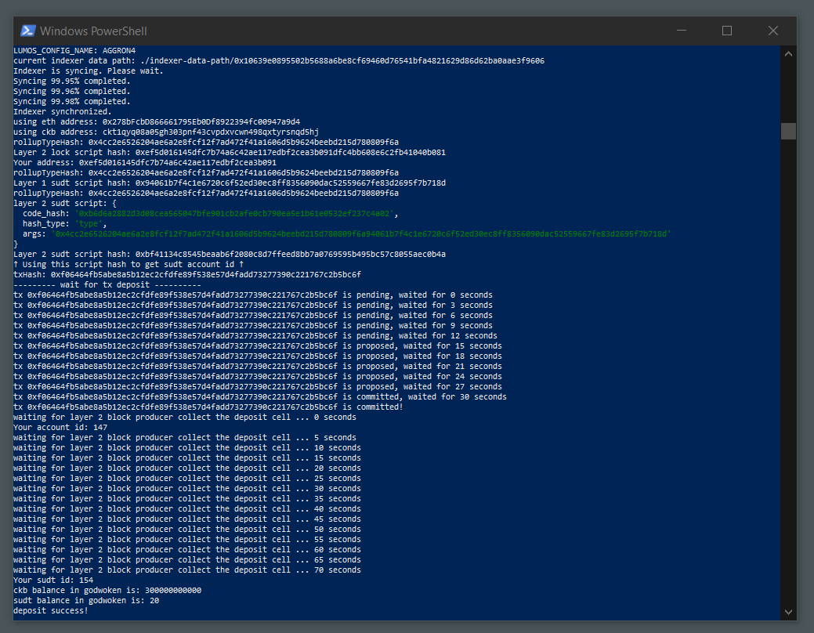

# Issue An SUDT Token On Layer 1 And Deposit It To Layer 2

## Task Submission

[CKB testnet address founded](https://explorer.nervos.org/aggron/address/ckt1qyq08a05gh303pnf43cvpdxvcwn498qxtyrsnqd5hj)

### SUDT created

[Transaction of the sudt created](https://explorer.nervos.org/aggron/transaction/0x95a516245896673988baa7a1e68e14449a588aa78047c6f439d5c5406e9459c8)

### SUDT from layer 1 to layer 2

[USDT ID](./assets/sudt-id.txt)
