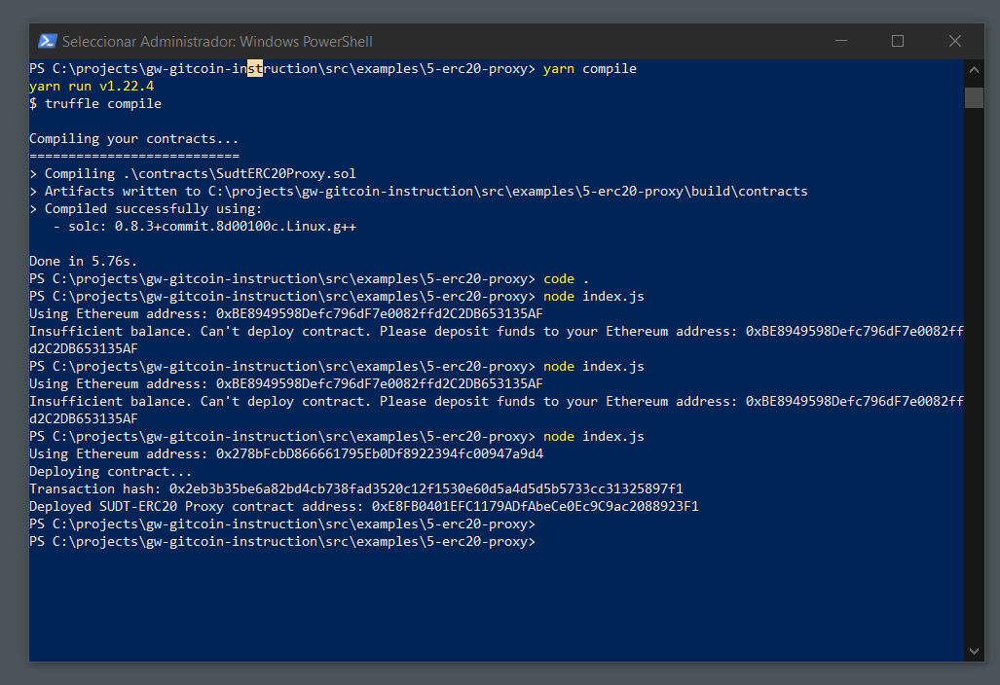
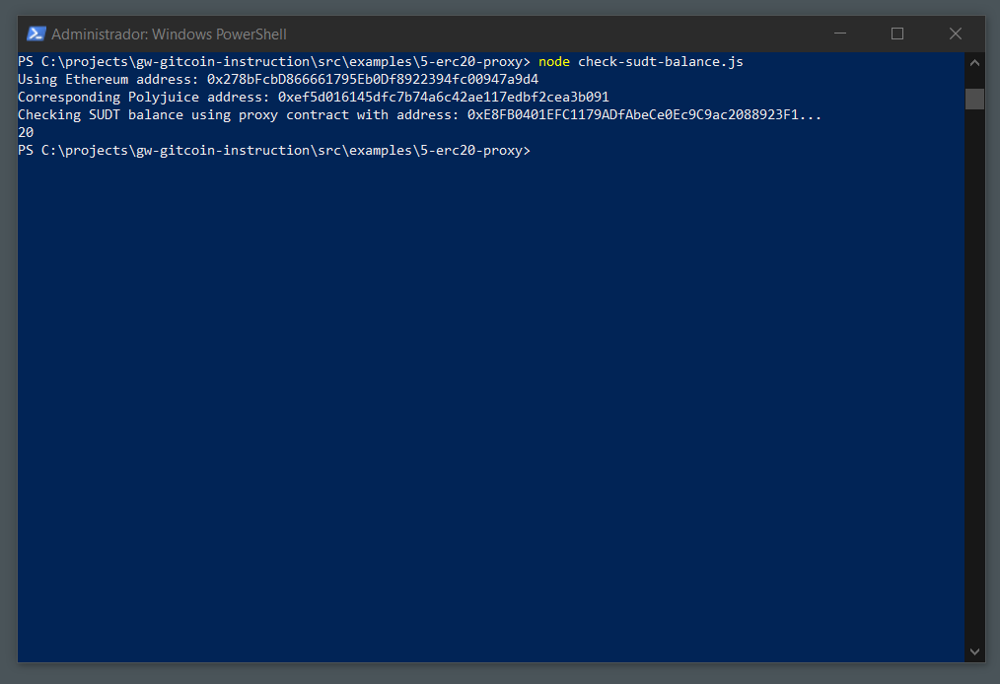

# Deploy The ERC20 Proxy Contract For The Deposited SUDT

## Task Submission

### Smart contract deployed

[ERC20 Proxy Contract Address](./assets/address-erc20-proxy-contract.txt)

### Checking Balance

[Ethereum Address Checked](./assets/ethereum-address.txt)
