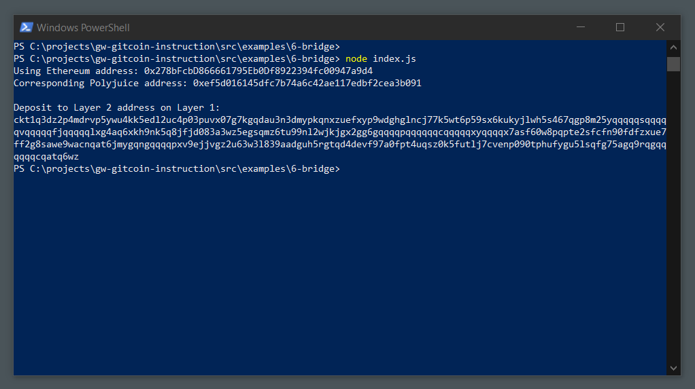

# Use Force Bridge To Deposit Tokens From Ethereum To Polyjuice

## Task Instructions

### Generating The Deposit Receiver Address.

[Deposit Receiver Address](./assets/deposit-receiver-address.txt)

[Ethereum address used to generate the Deposit Receiver Address](./assets/ethereum-address-used-to-deposit-address.txt)

## ETH to Polyjuice

[The link to the Etherscan explorer](https://rinkeby.etherscan.io/tx/0x4499d3ac0a1e4b8b79b12c9afda5be526dad1875013b98a3dd4b204b19b11463)

[The link to the Nervos explorer](https://explorer.nervos.org/aggron/transaction/0x6b190056eeaa4754659d92814724df6f778c35b3e39840fde26b928161ed1f21)
